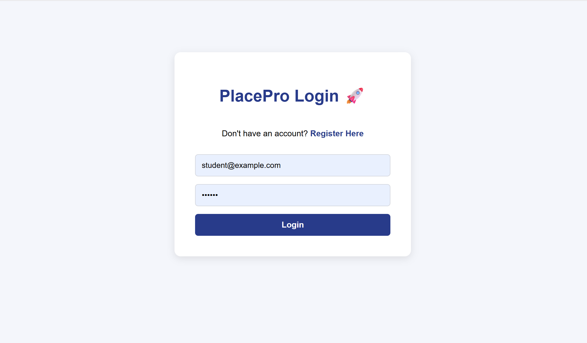
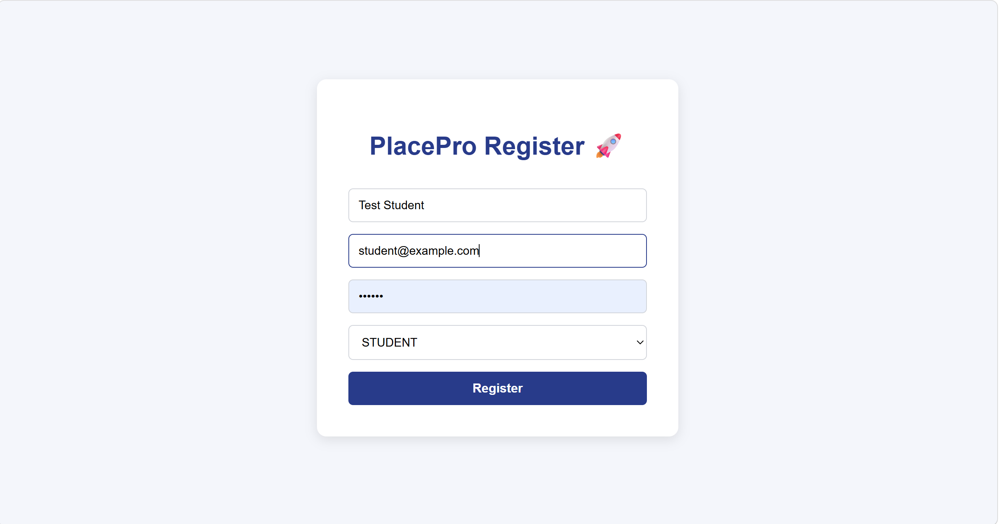
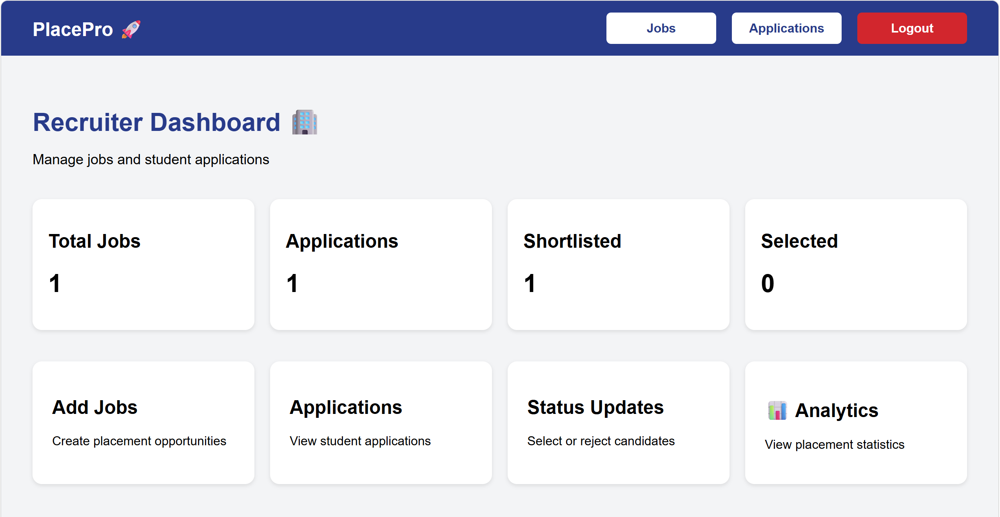
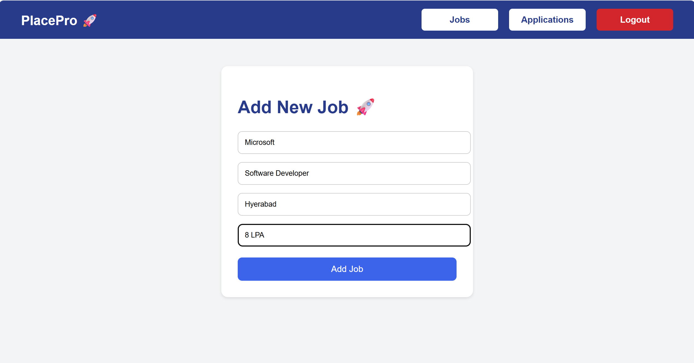
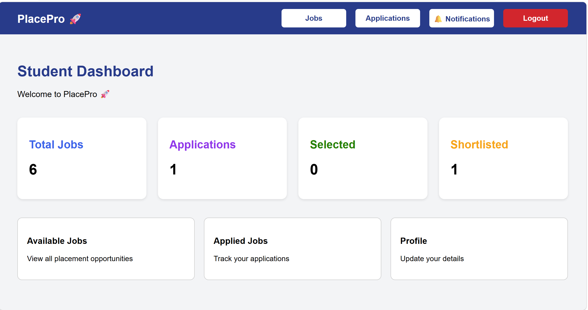
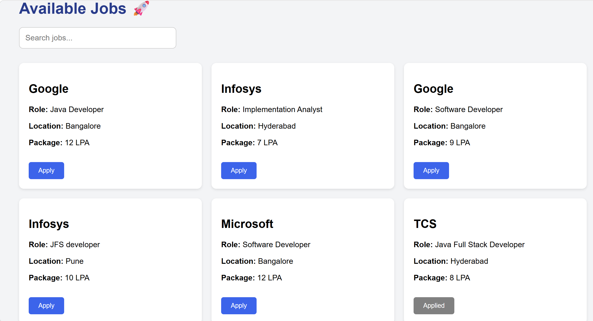
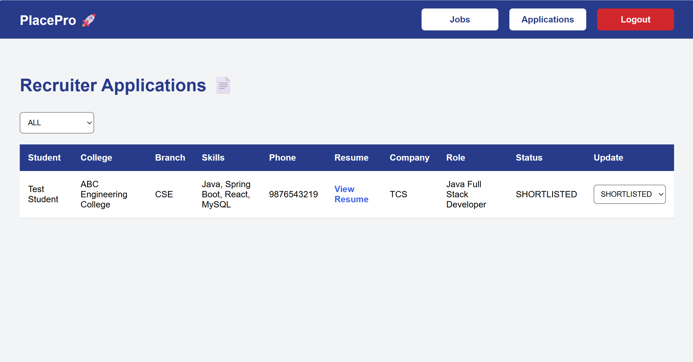
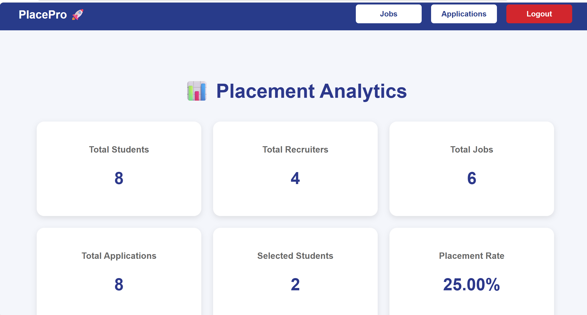

# PlacePro

PlacePro is a web-based placement and recruitment platform developed to simplify the hiring process for students and recruiters.

Students can create accounts, explore available job opportunities, upload resumes, and apply for jobs. Recruiters can post job openings, view applications, and manage candidates through a dedicated dashboard.

## Key Features

* Student Registration and Login
* Recruiter Registration and Login
* Secure JWT Authentication
* Job Posting and Management
* Job Search and Application
* Resume Upload
* Applicant Management
* Role-Based Access Control

## Technologies Used

Frontend

* React.js
* HTML
* CSS
* JavaScript
* Axios

Backend

* Spring Boot
* Spring Security
* REST APIs
* JWT Authentication

Database

* MySQL

## Project Repositories

Frontend:
https://github.com/SharanyaKishtapuram-star/placepro-frontend

Backend:
https://github.com/SharanyaKishtapuram-star/placepro-backend

## Future Enhancements

* Email Notifications
* Application Status Tracking
* Advanced Job Filters
* Recruiter Analytics Dashboard

## Developer

Sharanya Kishtapuram

## Screenshots

### Login Page

### Registration Page

### Recruiter Dashboard

### Add Job

### Student Dashboard

### Available Jobs

### Recruiter Applications

### Placement Analytics

